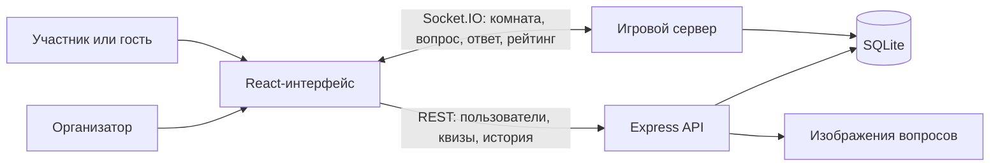
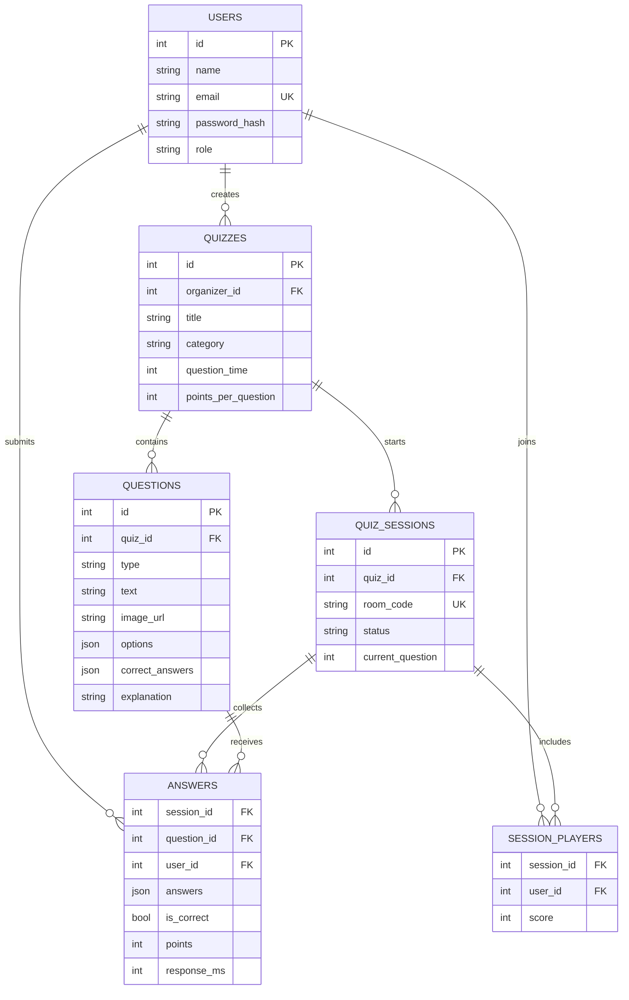
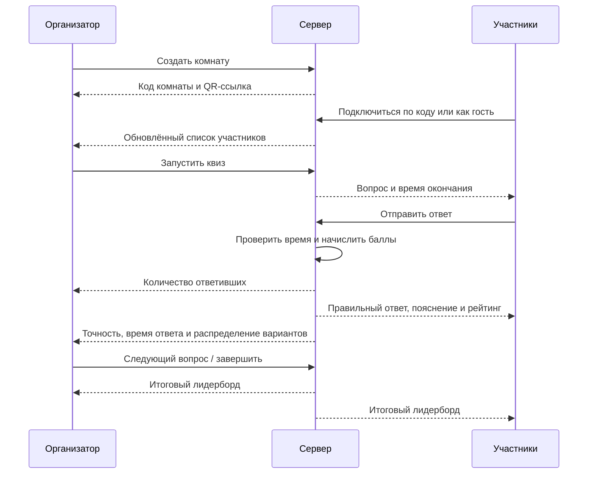

# Архитектура QuizRoom

## Общая схема

REST API отвечает за долговременные сущности: пользователей, гостевые профили, квизы, вопросы и историю. Socket.IO используется для событий текущей игры и восстановления комнаты после обновления страницы. Результаты каждого ответа сразу сохраняются в SQLite, поэтому итоговый лидерборд и история не зависят от состояния браузера.

## Модель данных

## Сценарий игры

Клиент сохраняет только код и роль активной комнаты. После обновления страницы он отправляет событие `room:resume`; сервер повторно проверяет права пользователя, возвращает текущий вопрос, принятый ответ и состояние таймера. QR-код создаётся локально, а ссылка автоматически открывает гостевой вход с заполненным кодом комнаты.

## Защита от некорректных действий

- сервер проверяет JWT при каждом REST-запросе и Socket.IO-подключении;
- управлять квизом может только его автор;
- один участник может отправить только один ответ на вопрос;
- ответ принимается только для текущего вопроса и до окончания таймера;
- правильные ответы не отправляются участникам до закрытия вопроса;
- тип и индексы выбранных вариантов проверяются на сервере.
